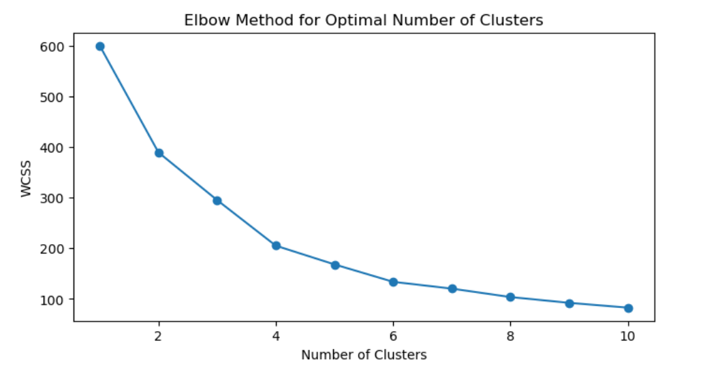
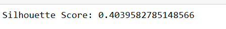
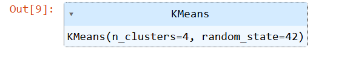
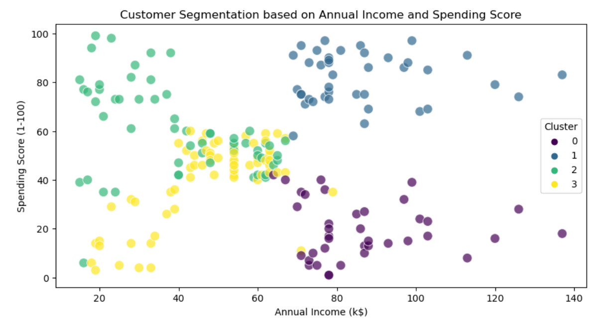

# BLENDED LEARNING
# Implementation of Customer Segmentation Using K-Means Clustering

## AIM:
To implement customer segmentation using K-Means clustering on the Mall Customers dataset to group customers based on purchasing habits.

## Equipments Required:
1. Hardware – PCs
2. Anaconda – Python 3.7 Installation / Jupyter notebook

## Algorithm
1. Load and Prepare Data
2. Determine Optimal Number of Clusters
3. Apply K-Means Clustering
4. Evaluate and Visualize Clusters 

## Program:
```
/*
Program to implement customer segmentation using K-Means clustering on the Mall Customers dataset.
Developed by: Rosetta Jenifer C
RegisterNumber:  212225230230
*/
```
```
import pandas as pd
import matplotlib.pyplot as plt
import seaborn as sns
from sklearn.cluster import KMeans
from sklearn.preprocessing import StandardScaler
from sklearn.metrics import silhouette_score
data = pd.read_csv('CustomerData.csv')
print(data.head())
print(data.columns)
features = ['Age', 'Annual Income (k$)', 'Spending Score (1-100)']
X = data[features]
scaler = StandardScaler()
X_scaled = scaler.fit_transform(X)
wcss = []

for i in range(1, 11):
    kmeans = KMeans(n_clusters=i, random_state=42)
    kmeans.fit(X_scaled)
    wcss.append(kmeans.inertia_)
plt.figure(figsize=(8,4))
plt.plot(range(1, 11), wcss, marker='o', linestyle='-')
plt.xlabel('Number of Clusters')
plt.ylabel('WCSS')
plt.title('Elbow Method for Optimal Number of Clusters')
plt.show()
optimal_clusters = 4
kmeans = KMeans(n_clusters=optimal_clusters, random_state=42)
kmeans.fit(X_scaled)
data['Cluster'] = kmeans.labels_
sil_score = silhouette_score(X_scaled, kmeans.labels_)
print(f'Silhouette Score: {sil_score}')
plt.figure(figsize=(10,5))
sns.scatterplot(data=data, x='Annual Income (k$)', y='Spending Score (1-100)', hue='Cluster', palette='viridis', s=100, alpha=0.7)

plt.title('Customer Segmentation based on Annual Income and Spending Score')
plt.xlabel('Annual Income (k$)')
plt.ylabel('Spending Score (1-100)')
plt.legend(title='Cluster')
plt.show()
```

## Output:






## Result:
Thus, customer segmentation was successfully implemented using K-Means clustering, grouping customers into distinct segments based on their annual income and spending score. 
